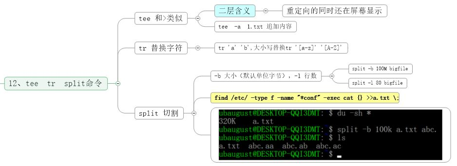

# shell 基础知识.md
---
## 1、Shell介绍  

## 2、命令历史  
  
## 3、命令补全和别名  
![图标]  (mdImages/1.jpg)  

## 4、通配符  
## 5、输入输出重定向  
## 6、管道符和作业控制  
## 7、Shell 变量（上）  
## 8、Shell 变量（下）  
## 9、环境变量配置文件  
## 10、特殊符号 cut命令  
## 11、sort  wc  uniq命令  
## 12、tee  tr  split命令  
## 13、shell特殊符号  

