# shell 基础知识.md
---  
## 1、Shell介绍  

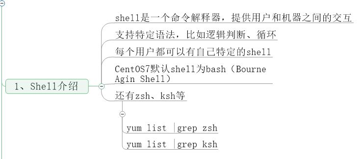

## 2、命令历史  
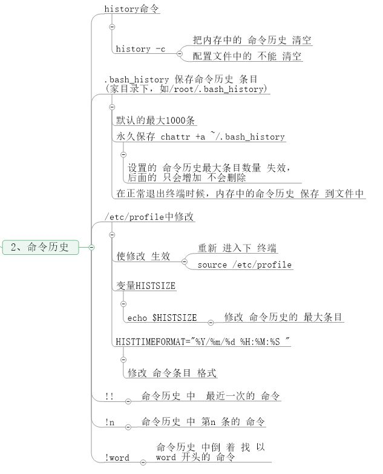  
## 3、命令补全和别名  
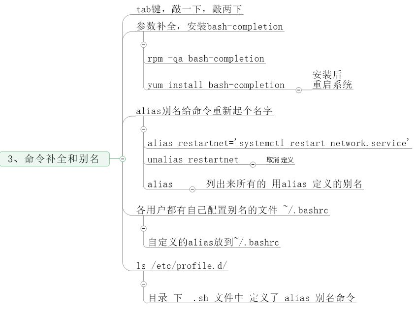  

## 4、通配符  
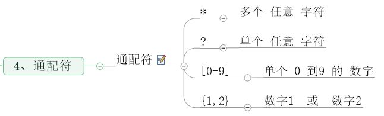 
## 5、输入输出重定向  
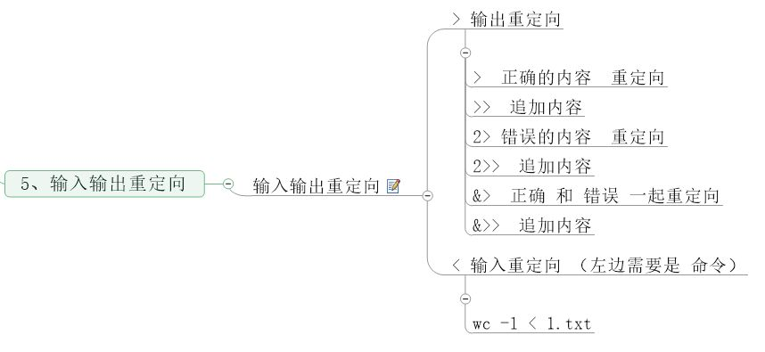 
## 6、管道符和作业控制  
 
## 7、Shell 变量（上）  
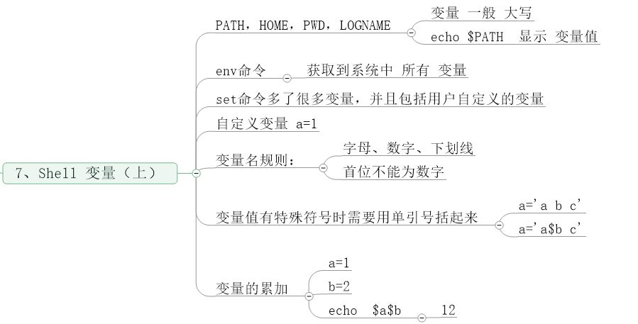 
## 8、Shell 变量（下）  
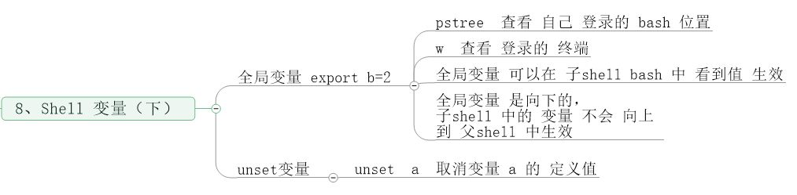 
## 9、环境变量配置文件  
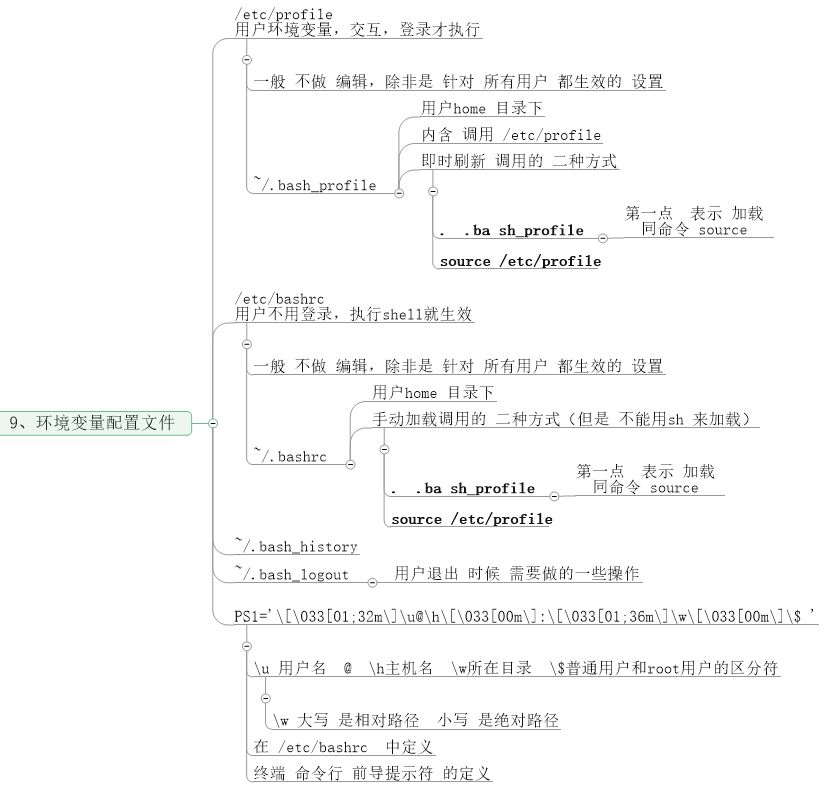 
## 10、特殊符号 cut命令  
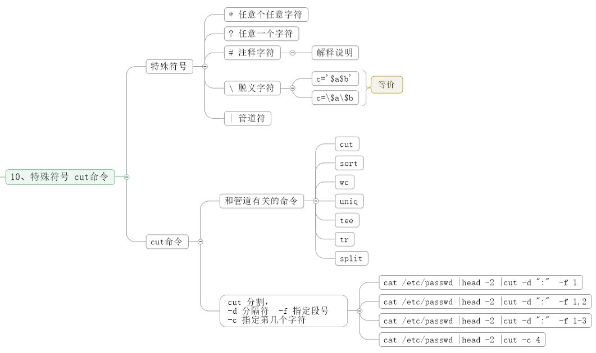 
## 11、sort  wc  uniq命令  
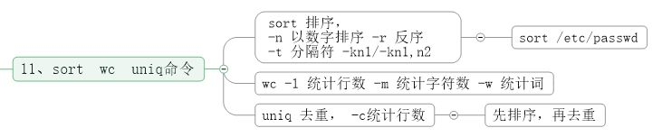 
## 12、tee  tr  split命令  
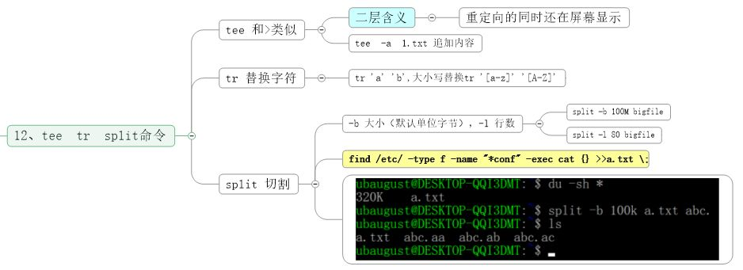 
## 13、shell特殊符号  
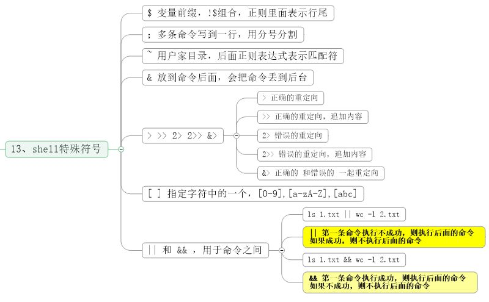 
### Shell脚本中的分号使用  
在Linux中，语句中的分号一般用作代码块标识

1、单行语句一般要用到分号来区分代码块，例如：
```
if [ "$PS1" ]; then echo test is ok; fi
test is ok
```  
该脚本或命令行中，需要两个分号才为正确的语句，第一个分号是then前的分号，用于标识条件块结束，第二个分号在fi前，用于标识then块结束，如果缺少这两个分号，则程序执行错误。
这里有趣的是echo后的字符串不需要使用引号也能正确地被识别。
注意：语句结尾不要分号。
2、该代码若写作多行，用换行符来区分代码块，则无需用到分号，例如：
```  
if [ "PS1" ]
> then echo "test is ok"
> fi
test is ok
```  
从这个例子可看出if判断语句分if块，then块，fi结束标识。当然还有可能有else if块，例如：
```  
if [ "$PS1" ]
> then echo test is ok
> elif [ "$PS2" ] 
> then echo here
> fi
test is ok
```  
注意：这里要使用elif，而不使用esle if，若使用else if，则为不完整语句，如下面的例子不能被正确执行：
```  
if [ "$PS1" ]
> then echo test is ok
> else if [ "$PS2" ] 
> then echo here
> else
> echo ""
> fi
> 
```  
敲回车后，shell程序认为句子没有完成，继续等待输入。

总结：
如果写成单行，需要用分号进行区分，如果写成块，那么则用换行符替代了分号。  

