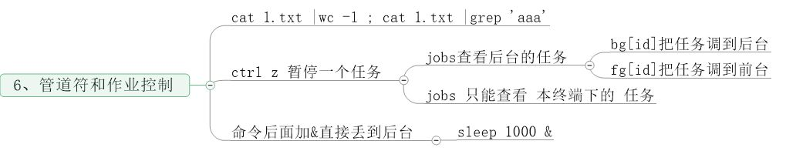

# shell 基础知识.md
---  
## 1、Shell介绍  

```BASH

    ubaugust@DESKTOP-QQI3DMT:~$ ll
    total 468
    drwxr-xr-x 1 ubaugust ubaugust    512 Nov 13 20:09 ./
    drwxr-xr-x 1 root     root        512 Mar  5  2019 ../
    -rw------- 1 ubaugust ubaugust   1347 Nov 13 21:03 .bash_history
    -rw-r--r-- 1 ubaugust ubaugust    220 Mar  5  2019 .bash_logout
    -rw-r--r-- 1 ubaugust ubaugust   3771 Mar  5  2019 .bashrc
    -rw-r--r-- 1 ubaugust ubaugust    807 Mar  5  2019 .profile
    -rw-r--r-- 1 ubaugust ubaugust      0 Jul 12 21:21 .sudo_as_admin_successful
    -rw-rw-rw- 1 ubaugust ubaugust 231816 Nov 13 20:04 a.txt
    -rw-rw-rw- 1 ubaugust ubaugust 102400 Nov 13 20:09 abc.aa
    -rw-rw-rw- 1 ubaugust ubaugust 102400 Nov 13 20:09 abc.ab
    -rw-rw-rw- 1 ubaugust ubaugust  27016 Nov 13 20:09 abc.ac
    ubaugust@DESKTOP-QQI3DMT:~$

```


## 2、命令历史  
  
## 3、命令补全和别名  
  

## 4、通配符  
 
## 5、输入输出重定向  
 
## 6、管道符和作业控制  
 
## 7、Shell 变量（上）  
 
## 8、Shell 变量（下）  
 
## 9、环境变量配置文件  
 
## 10、特殊符号 cut命令  
 
## 11、sort  wc  uniq命令  
 
## 12、tee  tr  split命令  
 
## 13、shell特殊符号  
 

